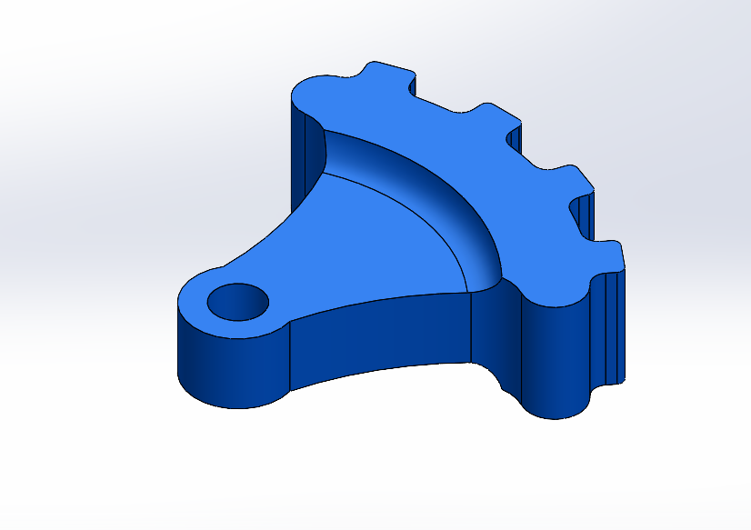
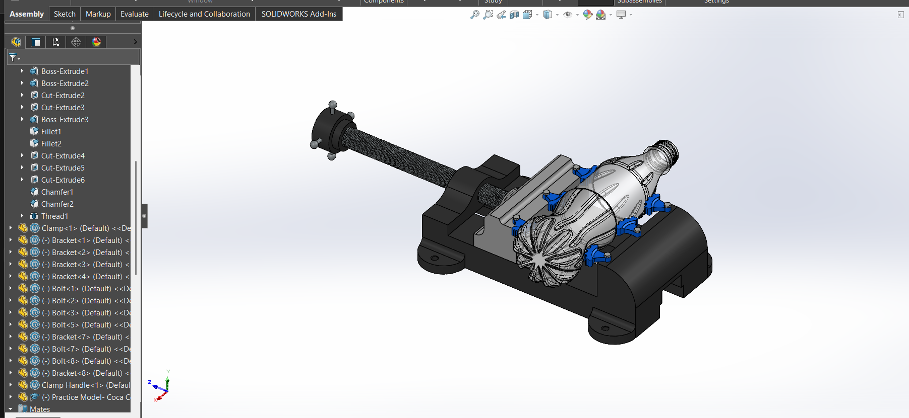

# OmniVice – Modular 3D-Printed Clamping Fixture  

A parametric **3D-printed modular bracket system** designed to act as an *OmniVice* for inspection setups.  
The goal: **simulate real-world fixturing in offline mode** to plan CMM probe paths, avoid collisions, and achieve right-first-time inspection runs.

---

## Purpose  

When programming in offline mode, a realistic setup is key to avoiding collisions and wasted machine time.  
This project provides a **digital twin** of an inspection fixture, including:
- **3D-printed modular brackets** – can be arranged in sets of three or more to grip round or irregular parts  
- **Fully modeled vise body and clamp** – matches the actual shop-floor vise for accurate simulation  
- **Tangent mates and realistic positioning** – lets you create a true-to-life setup before moving to the CMM  

With this setup, offline programs can be validated for:
- Part accessibility  
- Probe clearance  
- Interference detection  

…before ever touching the machine.

---

## Visual Overview  

### Bracket Close-Up  

### OmniVice in Action – Example Setup  

### Live Assembly Motion  
> Watch the vise clamp and release in SOLIDWORKS® – great for demonstrating part accessibility and clearance.  
▶ [Assembly in Action (MP4)](Media/Assembly%20in%20Action.mp4)

---

## Features  

- ✅ **Parametric design** – scale bracket size for different parts  
- ✅ **Offline-ready** – mate parts and fixtures exactly as you would on the shop floor  
- ✅ **3D-printable** – produce brackets quickly for real-world use  
- ✅ **Collision-safe** – run interference checks before the first live inspection  

---

## CAD Files Structure  

| Path / File              | Description                       |
|------------------------|-----------------------------------|
| **OmniVice.SLDASM**    | Main assembly file (vise + brackets) |
| **Vice Body.SLDPRT**   | Base vise model                   |
| **Clamp.SLDPRT**       | Clamp component                   |
| **Clamp Handle.SLDPRT**| Clamp handle                      |
| **Bracket.SLDPRT**     | Parametric 3D-printed bracket      |
| **Bolt.SLDPRT**        | Fasteners                         |
| **Sample Part.SLDPRT** | Example inspection part (bottle)   |

---

## How to Use  

1. **Open Assembly**  
   Load `OmniVice.SLDASM` in SOLIDWORKS®.  

2. **Create Mates**  
   Add tangent mates between brackets and the part to position it realistically.  

3. **Program Offline**  
   With the setup complete, create your CMM program in offline mode.  

4. **3D Print Brackets** *(Optional)*  
   Export `Bracket.SLDPRT` as STL, print 3×, and use them for real-world setups.  

---

## Relevance to CMM Programming  

This project supports **Lean Six Sigma principles** by reducing non-value-added time during prove-out.  
It allows engineers to:
- Verify setups virtually  
- Plan probe paths efficiently  
- Minimize trial-and-error on the shop floor  

---

## License  

Released under the **MIT License**.  
Forks, adaptations, and improvements are welcome.
